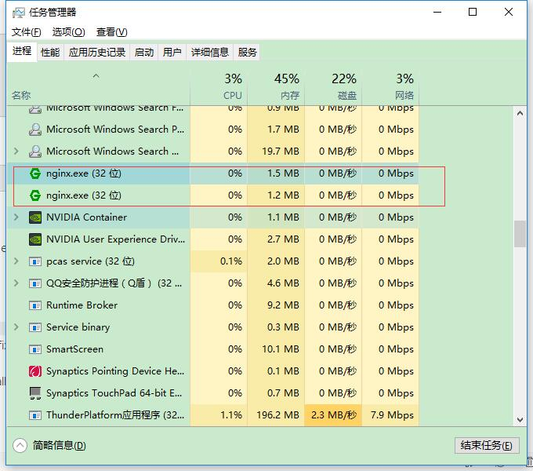
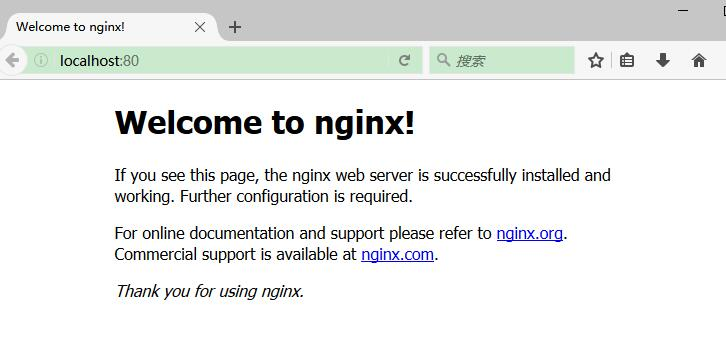

# 下载、安装

## 下载

NGINX 下载地址为：<http://nginx.org/en/download.html>。


## 安装

### Linux 和 BSD 的预构建软件包

大多数 Linux 发行版和 BSD 版本在通常的软件包存储库中都有 NGINX，它们可以通过任何通常用于安装软件的方法进行安装，如在 Debian 平台使用 `apt-get`，在 Gentoo 平台使用 `emerge`，FreeBSD 平台使用 `ports`等。

请注意，这些软件包通常有些过时。 如果您想要最新的功能和错误修复，建议从源代码或直接从 nginx.org 使用软件包。


### Red Hat/CentOS

首先添加 NGINX 的 yum 库，接着创建名为`/etc/yum.repos.d/nginx.repo` 的文件，并粘贴如下配置到文件中：

#### CentOS

```shell
[nginx]
name=nginx repo
baseurl=http://nginx.org/packages/centos/$releasever/$basearch/
gpgcheck=0
enabled=1
```


#### RHEL

```shell
[nginx]
name=nginx repo
baseurl=http://nginx.org/packages/rhel/$releasever/$basearch/
gpgcheck=0
enabled=1
```

由于CentOS、RHEL 和 Scientific Linux 之间填充`$releasever`变量的差异，有必要根据您的操作系统版本手动将`$releasever`变量的替换为5（5.x）或6（6.x））。


###  Debian/Ubuntu

#### Ubuntu：

此分发页面<http://nginx.org/packages/ubuntu/dists/?_ga=2.38823467.966088998.1495254706-741278569.1494679454>列出了可用的N GINX Ubuntu 版本支持。 有关Ubuntu版本映射到发布名称，请访问官方 Ubuntu 版本页面<https://wiki.ubuntu.com/Releases>。

在`/etc/apt/sources.list`中附加适当的脚本。 如果担心存储库添加的持久性（即DigitalOcean Droplets），则可以将适当的部分添加到`/etc/apt/sources.list.d/`下的其他列表文件中，例如`/etc/apt/sources.list.d/nginx.list`。

```shell
## Replace $release with your corresponding Ubuntu release.
deb http://nginx.org/packages/ubuntu/ $release nginx
deb-src http://nginx.org/packages/ubuntu/ $release nginx
```

比如 Ubuntu 16.04 (Xenial) 版本，设置如下:

```shell
deb http://nginx.org/packages/ubuntu/ xenial nginx
deb-src http://nginx.org/packages/ubuntu/ xenial nginx
```

要想安装，执行如下脚本:

```
sudo apt-get update
sudo apt-get install nginx
```

安装过程如果有如下的错误：

```
W: GPG error: http://nginx.org/packages/ubuntu xenial Release: The following signatures couldn't be verified because the public key is not available: NO_PUBKEY $key
```
 
则执行下面命令：

```shell
## Replace $key with the corresponding $key from your GPG error.
sudo apt-key adv --keyserver keyserver.ubuntu.com --recv-keys $key
sudo apt-get update
sudo apt-get install nginx
```


#### Debian 6

添加下面脚本到`/etc/apt/sources.list`：

```shell
deb http://nginx.org/packages/debian/ squeeze nginx
deb-src http://nginx.org/packages/debian/ squeeze nginx
```

#### Ubuntu PPA

这 个PPA 由志愿者维护，不由 nginx.org 分发。 由于它有一些额外的编译模块，所以可能更适合您的环境。

您可以从 Launchpad上 的[NGINX PPA](https://launchpad.net/~nginx/+archive/ubuntu/development) 获取最新的稳定版本的 NGINX。您将需要具有root权限才能执行以下命令。

Ubuntu 10.04 及更新版本：

```shell
sudo -s
nginx=stable # use nginx=development for latest development version
add-apt-repository ppa:nginx/$nginx
apt-get update
apt-get install nginx
```

如果有关于`add-apt-repository`的错误，则可能先要安装`python-software-properties`。对于其他基于 Debian/Ubuntu 的发行版，您可以尝试使用最可能在旧版套件上工作的 PPA 的变体：

```shell
sudo -s
nginx=stable # use nginx=development for latest development version
echo "deb http://ppa.launchpad.net/nginx/$nginx/ubuntu lucid main" > /etc/apt/sources.list.d/nginx-$nginx-lucid.list
apt-key adv --keyserver keyserver.ubuntu.com --recv-keys C300EE8C
apt-get update
apt-get install nginx
```

###  Win32 

安装命令为：

```shell
cd c:\
unzip nginx-1.13.0.zip
ren nginx-1.13.0 nginx
cd nginx
start nginx
```

如果有那问题，可以参看日志 `c:nginxlogserror.log`。

此外，目前，NGINX 官网只提供了 32位的安装包，如果想安装 64位的版本，可以查看由 Kevin Worthington 维护 Windows 版本 <https://kevinworthington.com/nginx-for-windows/>


## 验证安装
 
NGINX 正常启动后会占用 80 端口。打开任务管理器中，能够看到相关的 NGINX 活动线程。



打开浏览器，访问<http://localhost:80> 就能看到 NGINX 的欢迎页面。



关闭 NGINX 执行：

```shell
nginx -s stop 
```

其他常用控制语句有：

```
nginx -s [ stop | quit | reopen | reload ]
```

